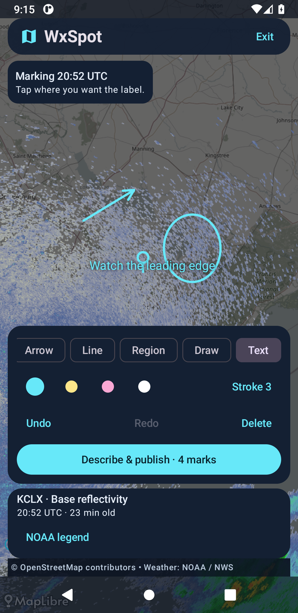
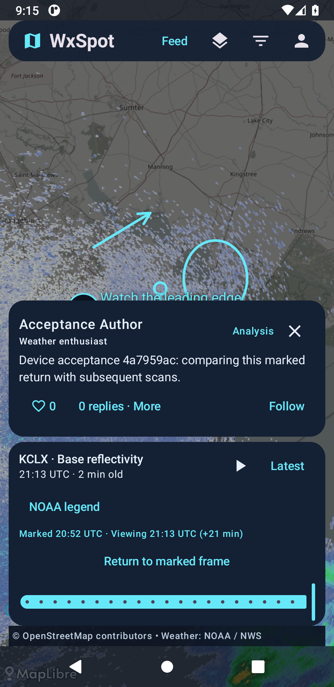
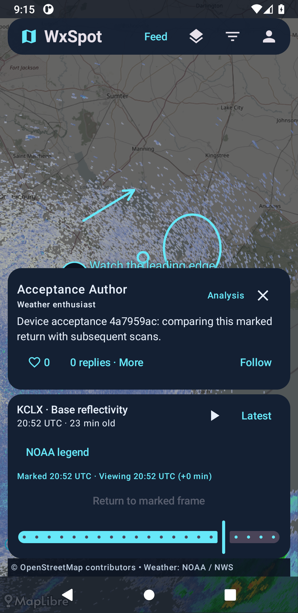
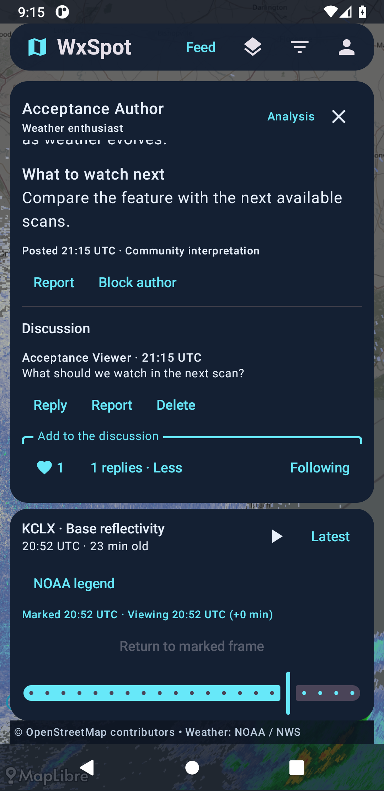
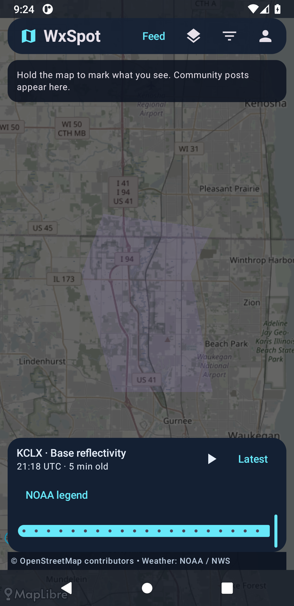
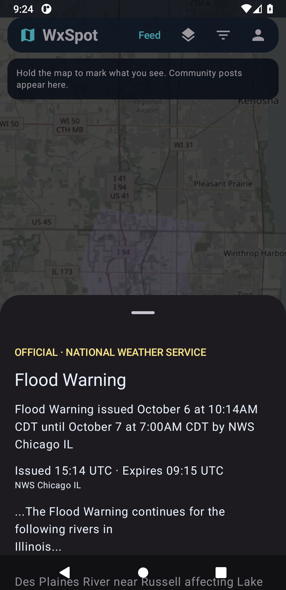

# Milestone 1 verification

This report records the original 0.1.0 milestone. The current 0.1.1 review build removes sign-in and registration screens and adds automatic device profiles, profile-name editing, and block-list controls; see [review access](REVIEW_ACCESS.md). Its device workflow uses two automatically issued profiles instead of manual registration.

WxSpot is an Android review build backed by the deployed FastAPI service, PostGIS, and durable object storage. It uses actual NOAA radar and NWS warnings in the app and live device tests. This is not a Play Store release.

## Architecture and decisions

Kotlin, Compose, and Material 3 provide the Android UI; MapLibre Native projects WGS84 marks over the weather layers. A lifecycle ViewModel owns editing, camera, timeline, and community state. Pure domain reducers keep editing history and replay immutable. The server is a FastAPI modular monolith with revocable library-managed authentication, PostgreSQL/PostGIS spatial queries, Alembic migrations, and S3-compatible media storage on Railway.

Posts preserve versioned camera/product/frame metadata and geographic vectors separately from an unmarked, georeferenced radar raster. This makes the original frame recoverable after NOAA's live retention expires. Live playback can advance beyond it without moving any marks. Providers, authentication, ranking, storage, and future explanations are separate boundaries. The client uses MapLibre's supported OpenGL renderer following an observed Vulkan emulator crash. See the [architecture and ADRs](ARCHITECTURE.md) for the consequential choices.

## Supported functionality

- Anonymous map browsing, radar play/pause and scrubbing, opacity, site/product selection, source states, and provider legends.
- Long-press captures the current context before an in-place sign-in prompt. Analysis, Observation, Question, and Photo/Report posts have a short required description plus optional title, topics, why-it-matters, and what-to-watch-next.
- Pin, circle/ellipse, arrow, polyline, polygon, freehand, and text tools; geographic move/resize, undo/redo, delete, color, and stroke. Local drafts can resume after app closure.
- Up to ten recent viewport posts, clustering, type/topic/verified-author filters, Recent/Top/Following/most-followed ranking, and a secondary feed that reopens the same map context.
- Exact marked-frame restoration, fixed vectors during subsequent frames, visible marked/viewing times and delta, and Return to marked frame.
- Likes, follows, one-level threaded discussions, in-app notifications, reports, blocks, soft deletion, and API moderation with an audit trail. Self-described and verified roles remain separate.

## Sources actually used

| Layer | Source and behavior |
| --- | --- |
| Radar | NOAA/NWS RIDGE2 WMS; base reflectivity and radial velocity; frames come from advertised capabilities, with explicit UTC valid time. KCLX is the initial site. |
| Official warnings | NWS `/alerts/active` GeoJSON, supplied polygon geometry, issuing office, provenance, and expiry. Current alerts are independent of the radar replay clock. |
| Basemap | OpenStreetMap standard raster tiles with attribution, caching, and a descriptive User-Agent; a low-volume review default. |

Details, official references, failure behavior, units, and deferred sources are in [weather data sources](WEATHER_DATA_SOURCES.md). Satellite, model, Level-II ingestion, and AI interpretation are not app features in this slice.

## Evidence

| Check | Result | Scope |
| --- | --- | --- |
| Backend formatting/lint and integration | [35 passed](https://github.com/michaelhmiv/WxSpot/actions/runs/37533099620) | Real PostGIS, permissions, spatial discovery, ranking, moderation, media, schemas, provider states. Upstream replacements exist only in explicitly isolated tests. |
| Android unit checks | [15 passed](https://github.com/michaelhmiv/WxSpot/actions/runs/37533099567) | Geographic editing, immutable replay, API authentication, and cached warning expiry without another network response. |
| Android formatting/lint/build | [Passed](https://github.com/michaelhmiv/WxSpot/actions/runs/37533099567) | Debug APK, device-test compilation, unsigned release optimization, and vital lint. Zero lint errors; 22 warnings remain. |
| Two-account device acceptance | [Passed, 45.416 seconds](https://github.com/michaelhmiv/WxSpot/actions/runs/37533100044) | Actual native gestures and visible auth, drawing, composer, feed, replay, social, and filter controls. |
| Official warning device test | [Passed, 6.269 seconds](https://github.com/michaelhmiv/WxSpot/actions/runs/37533100044) | Actual NWS polygon rendering/hit-testing, dashed outline, and official detail provenance. |
| Production Railway integration | Passed | Two accounts; actual NOAA scan; durable 804,880-byte S3 archive; recovered context/vectors; comment, like, follow, and spatial Following discovery. Test posts were removed and sessions revoked. |
| Release optimization | [Passed](https://github.com/michaelhmiv/WxSpot/actions/runs/37533099567) | Unsigned APK, R8/resource shrinking, vital lint; the review artifact is a debug build and release signing remains a launch gate. |

The production smoke and device workflow cover different boundaries: the former verifies Railway/S3; the latter runs an actual API and PostGIS on an accelerated Android emulator with live NOAA/NWS upstreams. Live tests fail on an unavailable upstream instead of substituting fabricated weather. Device evidence is not physical-device or novice usability testing.

### Device acceptance coverage

| Step | Required behavior | Device evidence |
| --- | --- | --- |
| 1 | Launch anonymously | Session is absent; map opens directly. |
| 2 | Current real radar | Advertised NOAA frames and a rendered raster are required. |
| 3 | Scrub recent frames | Visible animation controls and timeline are exercised. |
| 4 | Distinct official polygons | Separate live NWS rendering, dashed outline, hit-test, and official detail test passed. |
| 5 | Sign in | Native registration controls create the author account after contextual prompting. |
| 6 | Long-press radar | A real Android long-press immediately captures camera, product, and frame. |
| 7 | Annotation mode | Captured context survives authentication and opens the editor. |
| 8 | Circle/arrow/text markup | Pin, arrow, ellipse, and text are drawn; undo/redo is exercised. |
| 9 | Explanation | Description, why-it-matters, and what-to-watch-next are entered. |
| 10 | Publish | The real API persists the post, context, vectors, and radar archive. |
| 11 | Map representation | The published post appears in viewport discovery. |
| 12 | Another account opens it | Author signs out; viewer registers and selects the post in the feed. |
| 13 | Context reconstruction | Persisted context equality, camera tolerance, product, and decoded archived raster are checked. |
| 14 | Positioned vectors | The recovered geographic elements equal the published elements. |
| 15 | Advance several frames | Latest moves beyond the marked frame while elements remain equal. |
| 16 | Visible later time | A positive replay delta is asserted and captured in the screenshot. |
| 17 | Return to marked frame | Visible action restores the original time and camera; raster must finish rendering. |
| 18 | Like and comment | UI actions produce the liked state and persisted discussion. |
| 19 | Follow author | UI action produces the following state. |
| 20 | Different top-ten results | Following + Analysis includes the original and excludes a second Observation; result size remains at most ten. |

### Review build and screenshots

The downloadable universal debug APK is version 0.1.0, package `app.wxspot`, minimum API 26, targeting API 36. It connects to the deployed HTTPS Railway API. It was built from application commit `a65b74f15cf1fbf2e978ad1837373f6d75c573fa`; subsequent verification changes affect tests only. SHA-256: `9dc01397e6d03a8b7cb23429e7e268c2aa86c7eace9676b68ab20e5c38c1e1cf` (61,727,615 bytes). This APK is a review build, not a signed public release.

These are unaltered emulator captures of actual NOAA/NWS data. Acceptance-account text describes the test workflow and is not a meteorological finding.

The community captures are from [the first passing two-account run](https://github.com/michaelhmiv/WxSpot/actions/runs/37532153490). Official-warning captures are from the final complete passing run linked above. The application source is identical; the final run refines live polygon hit-testing in the instrumented test.

| Geographic editor | Later radar, fixed marks |
| --- | --- |
|  |  |

| Returned marked frame | Viewer discussion |
| --- | --- |
|  |  |

| Live official geometry | Separate NWS provenance |
| --- | --- |
|  |  |

## Replay contract

A post retains its camera, product/site/frame ID and valid time, layer metadata and opacity, WGS84 vectors, and a separate georeferenced radar image. Reopening uses the preserved raster at its recorded bounds. Advancing switches the weather frame while leaving coordinates unchanged; returning restores the marked time and camera. Capture-clock serialization uses the API's microsecond precision. Stored metadata and vector coordinates are compared exactly; the rendered camera permits a 1e-8 numerical tolerance for MapLibre projection round-trips. No markup is flattened into the preserved weather image.

## Boundaries before public launch

- The preserved marked radar image survives short live retention. Intermediate scans outside that live window are not ingested. The approximately 1024-pixel raster is not a retained full-resolution Level-II volume. Provider scale/unknown elevation are shown honestly where precise metadata is absent.
- Official warnings are live and not archived with radar posts. Cached geometry expires locally on the visible map every ten seconds, including during editing or an outage. Null geometry remains in the API without an invented footprint. This is not an emergency notification system.
- Profile editing and block-list management still require API access; moderation administration is API based.
- Email verification/recovery, release signing/distribution, Android 17 target-behavior validation, production basemap capacity, moderation operations, privacy/retention policy, and tested backup restoration remain launch work. The review APK targets API 36, with Android 8.0+ support.
- Physical-device coverage, screen-reader accessibility, prolonged battery/performance measurements, and broader poor-network testing remain necessary. Existing dependency/drawing-allocation lint warnings are documented rather than hidden.

## Phase 2 priorities

1. Finish launch operations: verified email/recovery, signing/distribution, moderation console and coverage, privacy/retention, backup restore drill, and production tile hosting.
2. Validate the map workflow with novices and physical Android devices. Refine handles, small-screen composer/discussion, accessibility, network recovery, rendering, and battery use from observed failures.
3. Add archival ingestion and lifecycle cleanup for intermediate scans beyond RIDGE2 retention. Expose coverage/resolution and monitor costs/freshness.
4. Expand radar products through the provider interface with reliable metadata, units, and quality flags. Add Level-II processing only when the workflow needs its resolution/tilts.
5. Introduce one satellite product, then one model family, each with immutable provenance, valid/run times, forecast hour or level, georeferencing, and equivalent replay tests.
6. Add mobile profile editing, block-list controls, richer discussion, targeted in-app notifications, and measured ranking refinements while keeping the map primary.
7. Explore source-grounded educational explanations after those foundations. Distinguish interpretation from official warnings and expose supporting data through the isolated explanation boundary.
